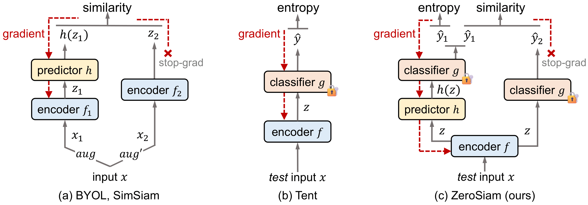

# ZeroSiam: An Efficient Asymmetry for Test-Time Entropy Optimization Without Collapse

This is the official project repository for [ZeroSiam: An Efficient Asymmetry for Test-Time Entropy Optimization Without Collapse (ICLR 2026)](https://github.com/Cascol-Chen/ZeroSiam) by Guohao Chen\*, Shuaicheng Niu\*, Deyu Chen, Jiahao Yang, Zitian Zhang, Mingkui Tan, Pengcheng Wu, Zhiqi Shen.

* 1️⃣ ZeroSiam addresses the collapse problem in **test-time entropy minimization**, where pure entropy minimization can drive models to degenerate solutions (e.g., constant one-hot outputs) that trivially minimize the objective without meaningful learning.
* 2️⃣ ZeroSiam introduces a **minimal asymmetric Siamese architecture** for test-time entropy minimization — using a single lightweight predictor and a stop-gradient operator — without requiring augmentations, extra encoder passes, or teacher models. This yields:
  1. Collapse prevention through asymmetric divergence alignment, which rules out collapsed trivial solutions as valid minima.
  2. Adaptive regularization of non-generalizable shortcut learning signals, boosting performance even when no collapse occurs.
  3. Negligible computational overhead — matching the latency of Tent (193s) on ViT-Base while substantially outperforming prior methods.
* 3️⃣ ZeroSiam is validated on both **vision adaptation** (ImageNet-C, 5 diverse architectures), demonstrating consistent gains across challenging wild test scenarios.

<p align="center">

</p>

## Dependencies Installation

We recommend setting up the environment via conda using the provided `environment.yml`:

```bash
conda env create -f environment.yml
conda activate zerosiam
```

## Data Preparation

**ImageNet-C** is used for vision adaptation experiments. Please download it from the [official repository](https://zenodo.org/record/2235448#.YzQpq-xBxcA) and organize as follows:

```
/path/to/imagenet-c/
├── gaussian_noise/
├── shot_noise/
├── impulse_noise/
...
```

## Model Preparation

All vision backbone weights are publicly available from [timm](https://github.com/rwightman/pytorch-image-models). However, since Google's ViT weight storage is no longer accessible, we have re-uploaded all required model checkpoints to Google Drive:

📦 **[Download model checkpoints here](https://drive.google.com/drive/folders/1cUryiwoqiKrdT_cAqlM7t67EflwZqy8e?usp=drive_link)**

Place the downloaded checkpoints under your local checkpoint directory and update the paths in `main.py` accordingly.

## Usage

```python
from tta_library import tent_head_clean_sam as tent_extra
from models.byol_wrapper import BYOLWrapper

model = TODO_model()
model = BYOLWrapper(model, model_name)
model = tent_extra.configure_model(model)
params, param_names = tent_extra.collect_params(model)

backbone_optimizer = torch.optim.SGD(params, lr * lr_scale, momentum=0.9)
predictor_optimizer = torch.optim.SGD(model.predictor.parameters(), lr * lr_p, momentum=0.9)

adapt_model = tent_extra.Tent(model, backbone_optimizer, predictor_optimizer)
output = adapt_model(inputs)
```

## Example: ImageNet-C Experiments

We provide a shell script `main.sh` for running experiments. Key configurable options:

| Argument | Options | Description |
|---|---|---|
| `--model` | `resnet50_gn_timm`, `vitbase_timm`, `vitsmall_timm`, `convnext_tiny`, `swin_tiny` | Backbone architecture |
| `--method` | `zerosiam`, `tent`, `sar`, `eata`, `deyo`, `deyo_come`, `no_adapt` | TTA method |
| `--exp_type` | `normal`, `label_shifts`, `bs1`, `label_shifts+bs1`, `mix_shifts`, `incorrect_labels_k1` | Test scenario |

**Quick start:**

```bash
bash main.sh
```

Or run manually with custom settings:

```bash
python3 main.py \
    --data /path/to/imagenet \
    --data_corruption /path/to/imagenet-c \
    --seed 2021 \
    --level 5 \
    --exp_type label_shifts \
    --method zerosiam \
    --lr_scale 5 \
    --lr_p 5 \
    --model vitbase_timm \
    --output ./outputs \
    --tag1 experiment \
    --tag2 run1
```

The recommended `lr_scale` and `lr_p` per model are:

| Model | `lr_scale` | `lr_p` |
|---|---|---|
| ResNet50-GN | 10 | 100 |
| ViT-Base | 5 | 5 |
| ViT-Small | 10 | 100 |
| ConvNeXt-Tiny | 10 | 100 |
| Swin-Tiny | 10 | 50 |

## Experimental Results

The table below reports average accuracy (%, ↑) on ImageNet-C (severity level 5) under **online imbalanced label shifts** across 5 architectures.

| Method | ResNet50-GN | ViT-Base | ViT-Small | ConvNeXt-Tiny | Swin-Tiny | Avg. |
|---|---|---|---|---|---|---|
| NoAdapt | 29.9 | 28.5 | 21.6 | 34.0 | 31.0 | 29.0 |
| Tent | 20.8 | 45.8 | 31.9 | 32.6 | 23.3 | 30.9 |
| SAR | 37.1 | 57.3 | 35.8 | 35.3 | 28.6 | 38.8 |
| EATA | 31.4 | 49.1 | 41.9 | 40.4 | 40.8 | 40.7 |
| COME | 29.7 | 61.6 | 38.8 | 43.8 | 38.5 | 42.5 |
| DeYO | 43.9 | 61.4 | 40.4 | 33.4 | 36.5 | 43.1 |
| **ZeroSiam (ours)** | **51.1** | **63.4** | **49.9** | **49.8** | **50.1** | **52.9** |

Please see our [paper](https://arxiv.org/pdf/2509.23183) for full results across all test scenarios (mixed shifts, batch size=1, blind-spot adaptation).

## Correspondence

Please contact Guohao Chen at [guohao.chen@ntu.edu.sg] and Shuaicheng Niu at [shuaicheng.niu@ntu.edu.sg] if you have any questions. 📬

## Citation

If ZeroSiam is helpful in your research, please consider citing our paper:

```bibtex
@inproceedings{chen2026zerosiam,
  title={ZeroSiam: An Efficient Asymmetry for Test-Time Entropy Optimization Without Collapse},
  author={Guohao Chen and Shuaicheng Niu and Deyu Chen and Jiahao Yang and Zitian Zhang and Mingkui Tan and Pengcheng Wu and Zhiqi Shen},
  booktitle={International Conference on Learning Representations},
  year={2026}
}
```

## Acknowledgment

The code is built upon [SAR](https://github.com/mr-eggplant/SAR). We thank the authors for their excellent work.